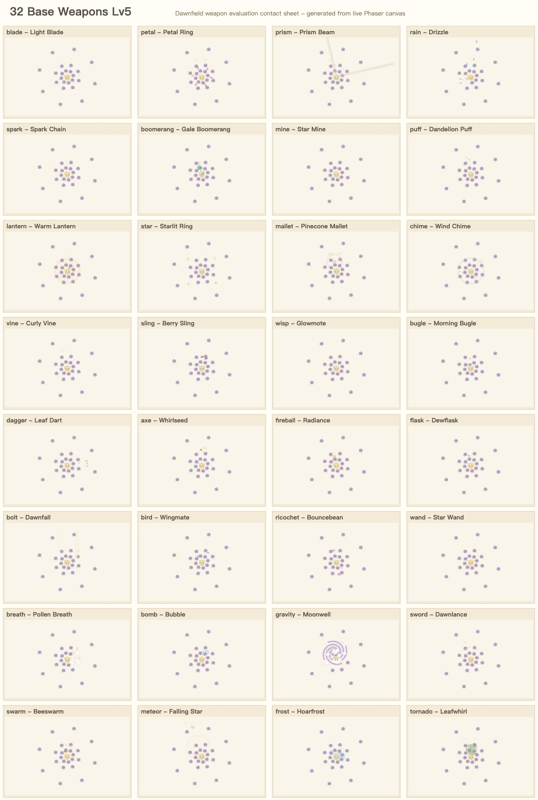
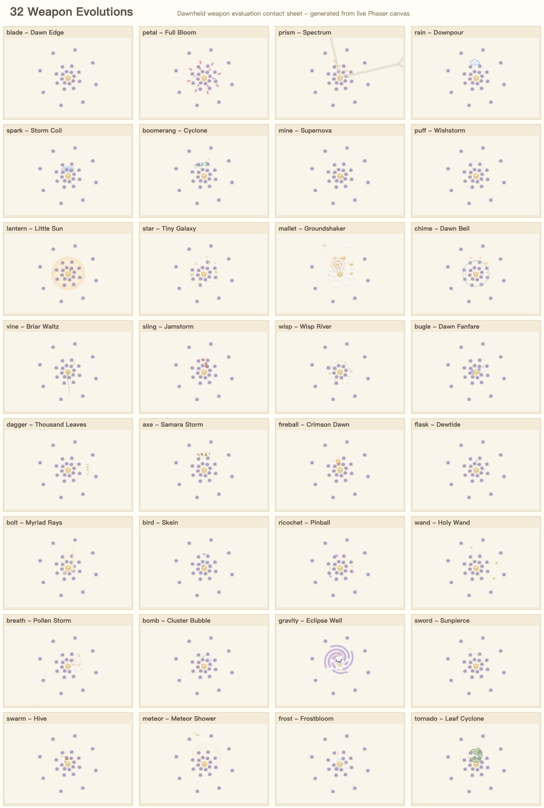

# 32 武器严格评估与修复复测（2026-06-14）

> 本文是原 32 武器评估的修复复测版。本轮已实际修改前三批问题武器的数值与少量命中拓扑；正式数据来自 `weaponEval32` sweep，第一批另跑 `60s ×3` 复核。

## 证据

| 证据 | 位置 |
|---|---|
| 多场景 DPS 原始数据 | `docs/balance/weapon-evaluation-32-data.json` |
| 多场景完整 Markdown 矩阵 | `docs/balance/weapon-evaluation-32-bench.generated.md` |
| 基础武器 Lv5 接触表 | `docs/balance/weapon-evaluation-32-contact-base.jpg` |
| 超武接触表 | `docs/balance/weapon-evaluation-32-contact-evo.jpg` |
| 基准方法与摘要 | `docs/balance/dps-M22-32-weapons.md` |

## 结论

- **P0：无。** 未发现武器系统整体失效、空白技能或无法复现的致命问题。
- **前三批阻断项已收敛。** 原 `flask/swarm/meteor/bomb/gravity/spark` 的 P1 高伤或超武跃迁已压回可解释区间；`spark` 怪潮进化/Lv5 从 17.58x 降至 sweep 3.28x，60s×3 复核为 3.88x。
- **第二批 P1 已降级。** `sling/bolt/bugle/axe/frost/prism` 不再出现无条件高伤或 5x-7x 超武开关；剩余问题主要是 `bugle` 怪潮超武偏弱、`prism` 静止三环偏低、`axe` 怪潮基础偏低。
- **第三批保留取向风险。** `petal/star/puff/wisp` 在部分场景仍低，但属于环绕/慢追踪/散射武器对 bench 场景的取向弱点；不再作为本轮阻断项，后续建议做机制身份强化而非继续硬拉 DPS。
- **视觉证据非空。** 64 个基础/超武格子均有主体表现；小弹体组仍建议后续强化描边/尾迹。

评分：1 = 明显需改，3 = 可接受但有风险，5 = 健康。P 级为下一步优先级。

## P1 前后对比

| 武器 | 原主要问题 | 当前 sweep 结果 | 处理结论 |
|---|---|---|---|
| `flask` | Lv5 4.38x / 7.05x / 3.81x | 1.01x / 1.96x / 0.79x | 池 DPS、瓶数和持续时间降温，保留地面控制。 |
| `swarm` | 怪潮 8.74x、单体 3.15x | 0.81x / 0.60x / 0.92x；进化/Lv5 怪潮 2.50x | 加单蜂命中上限和同目标节流，性能与单体叠加风险下降。 |
| `meteor` | 三场景约 3.3x | 1.63x / 1.99x / 1.45x | 常态弹数/陨坑降温，超武仍有大招感。 |
| `bomb` | 三场景均 2.6x+ | 1.56x / 1.83x / 1.41x | 主爆伤害与集束收益下降。 |
| `gravity` | 高伤并带吸拢控制 | 1.88x / 1.16x / 1.51x | 持续灼蚀与内爆折价，控制价值保留。 |
| `spark` | 怪潮超武/Lv5 17.58x | sweep 3.28x；60s×3 复核 3.88x | 基础链数/链距上调，超武小爆压缩。 |

## 第一批 60s×3 复核

下表为最终代码的复核数据；因只跑 6 把，表内不使用小样本中位比，只看绝对 DPS、进化/Lv5 和波动。

| 场景 | 武器 | Lv5 DPS | 进化 DPS | 进化/Lv5 | Lv5/进化 SD |
|---|---|---:|---:|---:|---:|
| 静止三环 | `flask` | 298.4 | 607.7 | 2.04x | 1.1% / 2.6% |
| 静止三环 | `swarm` | 232.7 | 419.7 | 1.80x | 3.6% / 1.8% |
| 静止三环 | `meteor` | 467.6 | 1017.2 | 2.18x | 0.4% / 1.9% |
| 静止三环 | `bomb` | 457.7 | 841.5 | 1.84x | 1.9% / 0.6% |
| 静止三环 | `gravity` | 560.4 | 784.1 | 1.40x | 0.1% / 0.2% |
| 静止三环 | `spark` | 492.6 | 489.5 | 0.99x | 0.2% / 0.2% |
| 移动怪潮 | `flask` | 1364.3 | 2341.4 | 1.72x | 0.1% / 0.1% |
| 移动怪潮 | `swarm` | 383.6 | 893.7 | 2.33x | 0.2% / 0.1% |
| 移动怪潮 | `meteor` | 1363.1 | 2605.8 | 1.91x | 0.2% / 0.1% |
| 移动怪潮 | `bomb` | 1218.6 | 1945.8 | 1.60x | 0.1% / 0.1% |
| 移动怪潮 | `gravity` | 780.9 | 1090.6 | 1.40x | 0.1% / 0.1% |
| 移动怪潮 | `spark` | 492.5 | 1910.1 | 3.88x | 0.3% / 0.1% |
| 单体小队 | `flask` | 101.8 | 208.1 | 2.04x | 2.3% / 3.9% |
| 单体小队 | `swarm` | 108.8 | 136.0 | 1.25x | 0.1% / 0.2% |
| 单体小队 | `meteor` | 146.6 | 332.0 | 2.26x | 9.1% / 4.6% |
| 单体小队 | `bomb` | 159.6 | 271.9 | 1.70x | 1.1% / 3.4% |
| 单体小队 | `gravity` | 176.9 | 245.3 | 1.39x | 0.1% / 0.2% |
| 单体小队 | `spark` | 217.3 | 229.6 | 1.06x | 0.2% / 0.9% |

## 32 武器评估

| 武器 | 数值 | 成长 | 超武 | 表现 | 独特 | P | 当前结论 |
|---|---:|---:|---:|---:|---:|---|---|
| `blade` | 3 | 4 | 2 | 4 | 4 | P2 | 三环健康、单体低；超武仍缺少明确数值回报。 |
| `petal` | 3 | 3 | 2 | 4 | 3 | P2 | 静止近身强，怪潮/单体弱；已补内圈与外抛，但仍是贴身防线定位。 |
| `prism` | 2 | 3 | 2 | 4 | 4 | P2 | 移动/单体健康，静止三环偏低；线束武器不宜继续按 AoE 表硬拉。 |
| `rain` | 3 | 4 | 2 | 4 | 4 | P2 | 怪潮强，进化倍率低；建议后续明确天气持续覆盖价值。 |
| `spark` | 3 | 3 | 3 | 4 | 4 | P2 | P1 跃迁已修；静止/单体超武回报偏低但怪潮定位清楚。 |
| `boomerang` | 3 | 3 | 2 | 4 | 4 | P2 | 怪潮偏强、单体进化偏弱；XP 吸附价值需在图鉴里解释。 |
| `mine` | 3 | 3 | 3 | 3 | 4 | P2 | 单体静止为 0 是场景限制；按布雷防线定位保留。 |
| `puff` | 2 | 3 | 3 | 3 | 3 | P2 | 单体健康，怪潮仍低；后续可提高远距离缓追可见性。 |
| `lantern` | 3 | 3 | 2 | 4 | 3 | P2 | 单体已由稀疏目标加热修正；超武倍率偏低，推开价值需说明。 |
| `star` | 2 | 3 | 3 | 4 | 3 | P2 | 怪潮/单体基础仍弱；远轨环绕身份明确，后续适合加首次接敌。 |
| `mallet` | 3 | 3 | 2 | 4 | 4 | P2 | 非前三批；单体超武跃迁仍高，留后续处理。 |
| `chime` | 2 | 3 | 2 | 4 | 4 | P2 | 非前三批；单体超武跃迁仍高。 |
| `vine` | 3 | 3 | 3 | 4 | 3 | P3 | 已补鞭长和宽度；移动/静止健康，单体进化偏工具。 |
| `sling` | 3 | 4 | 3 | 4 | 3 | P2 | 原高位稳定输出已压下；仍是强 AoE/控制混合项。 |
| `wisp` | 3 | 3 | 3 | 3 | 3 | P2 | 初始定向后单体强、怪潮弱；建议后续按“单体追踪”定位强化表现。 |
| `bugle` | 3 | 3 | 2 | 4 | 4 | P2 | 原 5x-7x 进化开关已修；怪潮进化偏弱，单体偏强。 |
| `dagger` | 3 | 4 | 3 | 3 | 3 | P2 | 单体强、怪潮中低；小弹体组相似风险保留。 |
| `axe` | 3 | 3 | 3 | 4 | 4 | P2 | 超武怪潮 6.30x 已降至 2.77x；基础怪潮略低。 |
| `fireball` | 3 | 3 | 3 | 4 | 3 | P2 | 怪潮强、静止低；慢穿透火球定位可解释。 |
| `flask` | 3 | 4 | 3 | 4 | 3 | P2 | P1 全场景过强已修；仍是怪潮强项。 |
| `bolt` | 3 | 4 | 3 | 4 | 3 | P2 | 密集怪潮过高已由命中上限修复；静止三环偏低。 |
| `bird` | 2 | 2 | 3 | 4 | 4 | P2 | 基础仍偏低，视觉身份清楚；后续可加强俯冲线宽。 |
| `ricochet` | 3 | 3 | 3 | 3 | 4 | P2 | 怪潮健康偏强，单体/静止偏低；反弹依赖场地是核心代价。 |
| `wand` | 3 | 4 | 3 | 3 | 3 | P2 | 单体强、怪潮弱；小弹体相似风险保留。 |
| `breath` | 3 | 3 | 3 | 3 | 3 | P3 | 整体可接受，表现可再强化。 |
| `bomb` | 3 | 4 | 3 | 4 | 3 | P2 | P1 稳定过高已修；仍是强 AoE 爆发。 |
| `gravity` | 3 | 4 | 3 | 4 | 4 | P2 | 高伤+控制已折价；静止三环仍强但未越界。 |
| `sword` | 3 | 3 | 3 | 3 | 3 | P3 | 非本轮重点；方向直线身份可继续强化。 |
| `swarm` | 3 | 4 | 3 | 3 | 4 | P2 | P1 怪潮/单体过强已修；实体数量和节流逻辑需留意性能。 |
| `meteor` | 3 | 4 | 3 | 4 | 4 | P2 | P1 高伤已修；仍保持预警大爆身份。 |
| `frost` | 3 | 3 | 3 | 4 | 4 | P2 | 超武 5x 跃迁已修；静止/怪潮略低但有减速价值。 |
| `tornado` | 4 | 4 | 3 | 3 | 4 | P3 | 接近健康，只建议视觉增强。 |

## 相似性检验

机制近似即标风险；视觉主题不同不抵消机制重复。

| 组 | 涉及武器 | 当前风险 | 区分建议 |
|---|---|---|---|
| 抛物/落点 AoE | `sling`、`flask`、`bomb`、`meteor` | 中高，已降温但仍是强覆盖组。 | `sling` 保留黏滞，`flask` 固定池，`bomb` 引信集束，`meteor` 预警大爆。 |
| 贴身环绕/护圈 | `petal`、`lantern`、`star` | 高，三者仍围绕玩家被动接触。 | `petal` 多瓣接触+外抛，`lantern` 灼烧推开，`star` 远轨周期。 |
| 自动小弹体 | `dagger`、`wand`、`wisp`、`bugle` | 中高。 | `dagger` 绑定移动方向，`wand` 稳定单体，`wisp` 缓追穿透，`bugle` 固定哨塔。 |
| 方向近战 | `blade`、`vine`、`sword`、`breath`、`mallet` | 中。 | 继续用前摇、持续、线宽、击退和二段效果拉开。 |
| 持续区域 | `flask`、`fireball`、`gravity`、`tornado` | 中。 | `gravity` 控制折价，`tornado` 游走卷击，`fireball` 轨迹穿透，`flask` 固定池。 |
| 天降/垂直打击 | `rain`、`bolt`、`meteor` | 中。 | `rain` 天气持续，`bolt` 限量点杀，`meteor` 预警大招。 |

## 性能风险

- `swarm` 已加单蜂命中上限和同目标节流，但仍是持续实体武器，需继续观察对象数量。
- `wisp`、`puff`、`bugle` 仍属于小弹体密集组，主要风险在命中遍历和粒子反馈。
- `flask`、`meteor`、`gravity`、`bomb` 的区域/爆发 FX 清晰但仍会主导画面，后续性能 profile 应看 `ZoneSystem.count`、粒子 burst 和震屏频率。
- 接触表证明技能主体非空、标签可读；它不是长时间性能 profile。

## 复核说明

- 正式 sweep：32 武器 × 4 形态 × 3 场景，每项 24s ×2。
- 第一批复核：`flask/swarm/meteor/bomb/gravity/spark`，每项 60s ×3。
- `singlePack` 不适合直接判定 `mine`；`movingSwarm` 会放大远程启动与追踪可靠性问题；贴身环绕武器在该口径天然吃亏。
